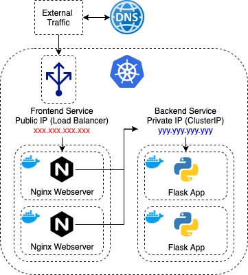

# Infrastructure

This sub-repository declares the infrastructure used to host the production infrastructure hosted in GCP. The infrastructure components are provisioned using terraform which includes the following terraform modules:
- `gke`, the kubernetes cluster (hosted in GCP)
- `vpc`, the external static-ip to be used by frontend load balancer
- `k8s`, the kubernetes service deployments (frontend and backend)
- `dns`, the google cloud dns records to resolve domain name to external static-ip

## Architecture

---
# Prerequisites

### Registered Domain
- `matttan90.com` is a registered
- within the `dns` terraform module, `matttan90.com` is hardcoded as the `dns_name`

### GCP
- create a GCP project within a GCP account
- create service-account credentials within GCP project (to be used by terraform)
- download service-account credentials (json)

### Docker Images
- upload application docker images to Google Container Registry
    - frontend: `gcr.io/<project-id>/frontend:latest`
    - backend: `gcr.io/<project-id>/backend:latest`

### Local Setup
- install terraform CLI
- set environment variable:
    - `export GOOGLE_CLOUD_KEYFILE_JSON=<path-to-service-account-credentials.json>`
- create `terraform.tfvars` variable file to be used by terraform
    - `cp terraform.tfvars.example terraform.tfvars`
    - edit `terraform.tfvars` with actual parameters

---
# Deployment

To deploy the whole infrastructure, follow these steps:
- ensure pwd is `/website/infrastructure`
- run command `$ terraform init`
- run command `$ terraform apply`
- ensure that domain registrar uses Cloud DNS nameservers
